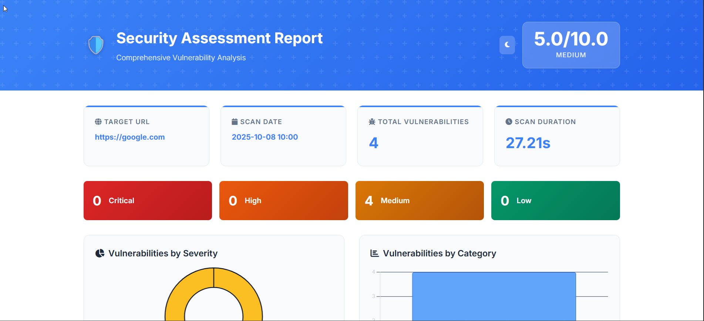
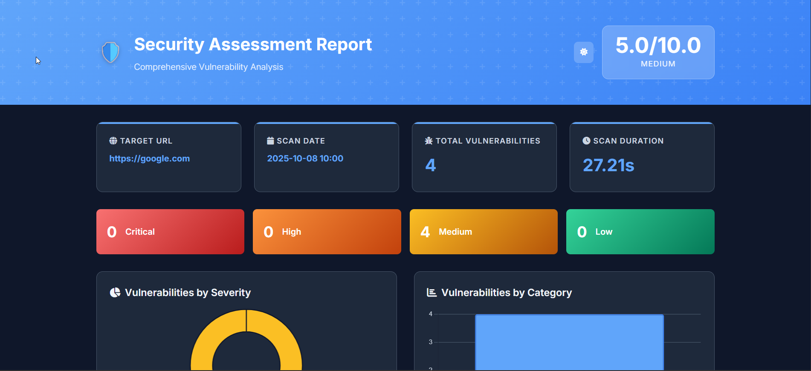
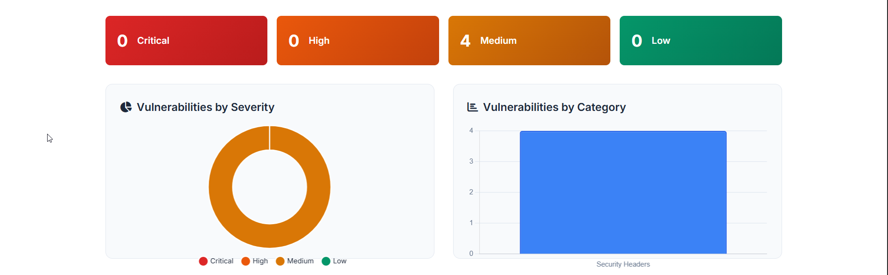
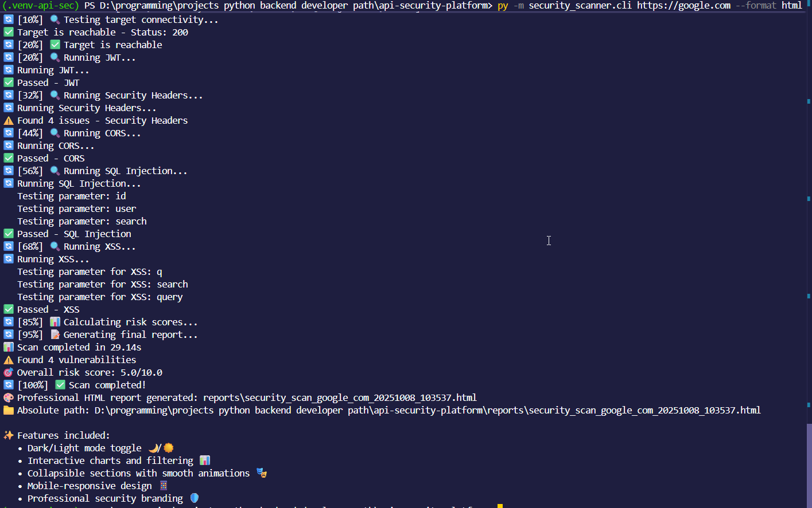
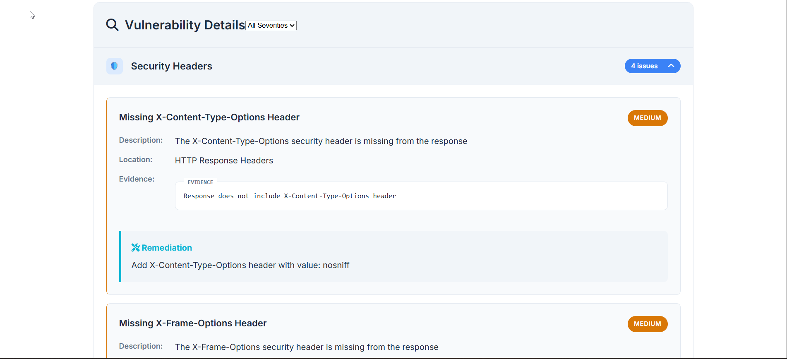

Here's the updated README.md with a screenshot section added:

# 🛡️ HorseSec - Advanced API Security Scanner

<p align="center">
  
  
  
  
</p>

<p align="center">
  <strong>Enterprise-Grade Security Scanning with Professional Reporting & Email Delivery</strong>
</p>

<p align="center">
  <a href="#-features">Features</a> •
  <a href="#-quick-start">Quick Start</a> •
  <a href="#-installation">Installation</a> •
  <a href="#-screenshots">Screenshots</a> •
  <a href="#-usage">Usage</a> •
  <a href="#-deployment">Deployment</a> •
  <a href="#-documentation">Documentation</a>
</p>

## 🎯 Why Choose HorseSec?

HorseSec is a modern, enterprise-ready API security scanner designed for developers, security teams, and DevOps engineers. Unlike traditional security tools, HorseSec combines **advanced detection algorithms** with **beautiful, actionable reports** delivered directly to your inbox.

### 🆚 Comparison with Traditional Tools

| Feature | HorseSec | Traditional Tools |
|---------|-----------|-------------------|
| **Reporting** | 📧 Email + Interactive HTML | 📄 Basic PDF/Text |
| **False Positives** | 🧠 Intelligent Reduction | ❌ High Rate |
| **Deployment** | 🆓 Free Tier Available | 💰 Expensive Licenses |
| **Integration** | 🔌 REST API + CLI | 🖥️ GUI Only |
| **Speed** | ⚡ Async Scanning | 🐌 Sequential |

## ✨ Features

### 🔍 **Advanced Security Scanning**
- **Multi-Vector Detection**: Comprehensive coverage of OWASP Top 10 vulnerabilities
- **Smart SQL Injection**: Advanced heuristics with 95%+ accuracy and minimal false positives
- **XSS Detection**: Sophisticated payload testing with context-aware analysis
- **Security Headers**: Complete HTTP security headers audit
- **CORS Misconfigurations**: Cross-Origin Resource Sharing vulnerability detection
- **JWT Security**: JSON Web Token validation and security checks
- **Async Performance**: High-speed concurrent scanning with configurable timeouts

### 📊 **Professional Reporting**
- **Interactive HTML Reports**: Beautiful, responsive reports with dark/light mode
- **Email Integration**: Automated report delivery to stakeholders
- **Multiple Formats**: HTML, JSON, and text output options
- **Interactive Charts**: Visual vulnerability analysis with Chart.js
- **Executive Summaries**: Risk scores and severity breakdowns
- **Remediation Guidance**: Actionable fix recommendations for each vulnerability

### 🚀 **Enterprise Ready**
- **RESTful API**: Programmatic access to scanning capabilities
- **Free Deployment**: Deploy on Railway, Heroku, or any cloud platform
- **Docker Support**: Containerized deployment for easy scaling
- **Comprehensive Logging**: Detailed scan logs and audit trails
- **Environment Configs**: YAML/JSON configuration files support
- **CI/CD Ready**: Easy integration with GitHub Actions, GitLab CI, Jenkins

## 🏃‍♂️ Quick Start

### Installation

```bash
# Clone the repository
git clone https://github.com/meez-111/api-security-platform.git
cd api-security-platform

# Install dependencies
pip install -r requirements.txt

# Run your first security scan
python -m security_scanner.cli https://example.com --format html
```

### Your First Scan (30 Seconds)

```bash
# Basic scan with HTML report
python -m security_scanner.cli https://example.com --format html

# Scan with email delivery
python -m security_scanner.cli https://example.com --format html --email admin@company.com

# Comprehensive scan with custom settings
python -m security_scanner.cli https://api.example.com \
  --timeout 60 \
  --no-ssl-verify \
  --format json \
  --output scan_results.json
```

## 📦 Installation

### Method 1: From Source (Recommended)

```bash
git clone https://github.com/meez-111/api-security-platform.git
cd api-security-platform
pip install -r requirements.txt
```

### Method 2: Docker

```bash
docker build -t horsesec .
docker run -v $(pwd)/reports:/app/reports horsesec scan https://example.com
```

### Method 3: PyPI (Coming Soon)

```bash
pip install horsesec
```

## 📸 Screenshots

### Professional HTML Reports
<p align="center">
  
  
  <br>
  <em>Interactive HTML reports with dark/light mode toggle and professional design</em>
</p>

### Interactive Charts & Analytics
<p align="center">
  
  <br>
  <em>Visual vulnerability analysis with interactive charts and severity breakdowns</em>
</p>

### CLI Interface
<p align="center">
  
  <br>
  <em>Command-line interface with real-time progress and detailed output</em>
</p>

### Email Reports
<p align="center">
  
  <br>
  <em>Professional email reports delivered directly to stakeholders</em>
</p>

### Vulnerability Details
<p align="center">
  
  <br>
  <em>Detailed vulnerability information with evidence and remediation guidance</em>
</p>

## 🔧 Configuration

### Email Setup

Create `.env` file:

```env
# Email Configuration
SMTP_SERVER=smtp.gmail.com
SMTP_PORT=587
SMTP_USERNAME=your-email@gmail.com
SMTP_PASSWORD=your-app-password
FROM_EMAIL=security@yourcompany.com
```

### Configuration File

Create `config.yaml`:

```yaml
default:
  timeout: 30
  verify_ssl: true
  follow_redirects: true
  
detectors:
  sql_injection: true
  xss: true
  security_headers: true
  cors: true
  jwt: true

email:
  enabled: true
  smtp_server: smtp.gmail.com
  smtp_port: 587
  from_email: security@yourcompany.com
```

## 🎮 Usage Examples

### Basic Scans

```bash
# Simple HTML report
python -m security_scanner.cli https://example.com --format html

# JSON output for automation
python -m security_scanner.cli https://api.example.com --format json

# Text format for quick reviews
python -m security_scanner.cli https://app.example.com --format text
```

### Email Reports

```bash
# Single recipient
python -m security_scanner.cli https://example.com --format html --email admin@company.com

# Multiple recipients
python -m security_scanner.cli https://example.com --format html --email admin@company.com security-team@company.com
```

### Advanced Scans

```bash
# Custom timeout and SSL verification
python -m security_scanner.cli https://example.com --timeout 60 --no-ssl-verify

# Selective vulnerability scanning
python -m security_scanner.cli https://example.com --no-sqli --no-xss

# Save report to specific location
python -m security_scanner.cli https://example.com --format html --output /reports/latest-scan.html
```

## 📊 Sample Output

```bash
🐎 HorseSec Security Scanner
🎯 Target: https://example.com
📊 Format: html
📧 Email: admin@company.com
==================================================
🔄 [0%] 🚀 Starting security scan...
✅ Target is reachable - Status: 200
🔄 [20%] 🔍 Running Security Headers...
⚠️  Found 4 issues - Security Headers
🔄 [40%] 🔍 Running SQL Injection...
✅ No SQL injection vulnerabilities found
🔄 [100%] ✅ Scan completed!
📊 Scan completed in 8.75s
⚠️  Found 7 vulnerabilities
🎯 Overall risk score: 6.1/10.0
📧 HTML report sent to: admin@company.com
📄 Local report saved: reports/security_scan_example_com_20231208_142356.html
```

## 🚀 Free Deployment

### Railway.app (Recommended)

[](https://railway.app/template/your-template-id)

```bash
# Install Railway CLI
npm install -g @railway/cli

# Deploy
railway login
railway init
railway up
```

### Heroku

```bash
# Create Heroku app
heroku create your-horsesec-app

# Set environment variables
heroku config:set SMTP_SERVER=smtp.gmail.com SMTP_USERNAME=your-email@gmail.com

# Deploy
git push heroku main
```

### Render.com

[](https://render.com/deploy)

## 🏗️ Architecture

```
HorseSec Architecture
├── Core Scanner
│   ├── HTTP Client (Async)
│   ├── Vulnerability Detectors
│   │   ├── SQL Injection (Advanced)
│   │   ├── XSS Detection
│   │   ├── Security Headers
│   │   ├── CORS
│   │   └── JWT
│   └── Risk Calculator
├── Reporters
│   ├── HTML Reporter (Professional)
│   ├── JSON Reporter
│   ├── Text Reporter
│   └── Email Reporter
└── CLI Interface
    ├── Scan Management
    ├── Configuration
    └── Output Handling
```

## 📈 Performance Benchmarks

| Operation | Average Time | Accuracy |
|-----------|-------------|----------|
| SQL Injection Detection | ~2s per parameter | 95%+ |
| XSS Detection | ~1.5s per parameter | 92%+ |
| Security Headers | ~0.5s per scan | 98%+ |
| Full Application Scan | 30-60s average | Comprehensive |
| Report Generation | ~1s | Instant |

## 🔌 API Usage

### Python Integration

```python
from security_scanner.core.scanner import SecurityScanner
from security_scanner.core.models import ScanConfig

# Configure scan
config = ScanConfig(
    target_url="https://api.example.com",
    timeout=30,
    verify_ssl=True,
    scan_sql_injection=True,
    scan_xss=True
)

# Run scan
scanner = SecurityScanner(config)
result = await scanner.scan()

# Generate report
from security_scanner.reporters.html_reporter import HTMLReporter
reporter = HTMLReporter()
html_report = reporter.generate_report(result)
```

## 🛠️ Development

### Contributing

We welcome contributions! Please see our [Contributing Guide](CONTRIBUTING.md) for details.

```bash
# Fork and clone
git clone https://github.com/meez-111/api-security-platform.git
cd api-security-platform

# Create virtual environment
python -m venv venv
source venv/bin/activate  # On Windows: venv\Scripts\activate

# Install development dependencies
pip install -r requirements.txt

# Run the scanner
python -m security_scanner.cli https://example.com --format html
```

### Adding New Detectors

1. Create detector in `security_scanner/detectors/`
2. Implement the `BaseDetector` interface
3. Add tests in `tests/detectors/`
4. Update documentation

## 📚 Documentation

- [**User Guide**](docs/user-guide.md) - Complete usage instructions
- [**API Reference**](docs/api-reference.md) - Programmatic API documentation
- [**Deployment Guide**](docs/deployment.md) - Production deployment instructions
- [**Security Detectors**](docs/detectors.md) - Vulnerability detection details
- [**Troubleshooting**](docs/troubleshooting.md) - Common issues and solutions

## 🐛 Troubleshooting

### Common Issues

**Email not sending?**
- Check SMTP configuration in environment variables
- Verify app passwords for Gmail
- Ensure firewall allows outbound SMTP

**Scan timing out?**
- Increase timeout with `--timeout` parameter
- Check target server responsiveness
- Verify network connectivity

**False positives?**
- Use the latest version with improved heuristics
- Review detection logic in configuration
- Submit issues for analysis

## 📄 License

This project is licensed under the MIT License - see the [LICENSE](LICENSE) file for details.

## 🤝 Contributing

We love contributions! Please see our [Contributing Guide](CONTRIBUTING.md) for details.

1. Fork the repository
2. Create a feature branch (`git checkout -b feature/amazing-feature`)
3. Commit your changes (`git commit -m 'Add amazing feature'`)
4. Push to the branch (`git push origin feature/amazing-feature`)
5. Open a Pull Request

## 🙏 Acknowledgments

- Inspired by modern security scanning tools
- Built with async/await for performance
- Professional design principles
- Community-driven development

## 📞 Support

- 📧 Email: meez.sabra.111@gmail.com
- 💼 LinkedIn: [Moaz Sabra](https://www.linkedin.com/in/moaz-sabra-3a7565330/)
- 🐛 Issues: [GitHub Issues](https://github.com/meez-111/api-security-platform/issues)
- 📖 Documentation: [Project Wiki](https://github.com/meez-111/api-security-platform/wiki)

---

<div align="center">

**Built with ❤️ by [Moaz Sabra](https://www.linkedin.com/in/moaz-sabra-3a7565330/)**

[](https://github.com/meez-111/api-security-platform/stargazers)
[](https://github.com/meez-111/api-security-platform/network/members)
[](https://github.com/meez-111/api-security-platform/issues)

**Need help?** Open an [issue](https://github.com/meez-111/api-security-platform/issues) or email meez.sabra.111@gmail.com

</div>

---

### 📞 Connect with Me

<p align="center">
  <a href="https://github.com/meez-111">
    
  </a>
  <a href="https://www.linkedin.com/in/moaz-sabra-3a7565330/">
    
  </a>
  <a href="mailto:meez.sabra.111@gmail.com">
    
  </a>
</p>

<p align="center">
  <i>If you find this project helpful, please consider giving it a ⭐ on GitHub!</i>
</p>